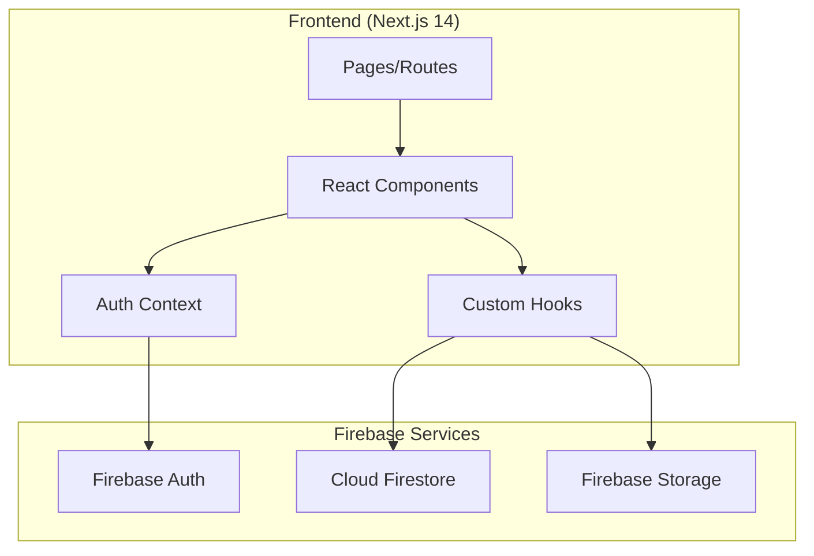

# Design Document: KuzTube Video Platform

## Overview

KuzTube — видеоплатформа на базе Next.js 14 (App Router) с Firebase backend. Приложение использует серверные и клиентские компоненты React, Firebase Auth для аутентификации, Firestore для хранения данных и Firebase Storage для медиафайлов.

## Architecture



## Components and Interfaces

### Page Structure

```
app/
├── page.tsx                    # Главная страница (/)
├── layout.tsx                  # Root layout с Header
├── login/page.tsx              # Страница входа
├── register/page.tsx           # Страница регистрации
├── upload/page.tsx             # Загрузка видео
├── watch/[id]/page.tsx         # Просмотр видео
└── channel/[id]/page.tsx       # Страница канала
```

### Core Components

```typescript
// Header Component
interface HeaderProps {
  user: User | null;
}

// VideoCard Component
interface VideoCardProps {
  id: string;
  title: string;
  thumbnail: string;
  authorName: string;
  authorId: string;
  views: number;
}

// VideoPlayer Component
interface VideoPlayerProps {
  videoUrl: string;
}

// CommentSection Component
interface CommentSectionProps {
  videoId: string;
  videoOwnerId: string;
  currentUserId: string | null;
}

// Comment Component
interface CommentProps {
  id: string;
  text: string;
  authorId: string;
  authorName: string;
  createdAt: Timestamp;
  isPinned: boolean;
  canDelete: boolean;
  canPin: boolean;
}

// ChannelHeader Component
interface ChannelHeaderProps {
  channelId: string;
  banner: string;
  avatar: string;
  name: string;
  subscriberCount: number;
  isOwner: boolean;
  isSubscribed: boolean;
}

// LikeDislikeButtons Component
interface LikeDislikeButtonsProps {
  videoId: string;
  likes: number;
  dislikes: number;
  userReaction: 'like' | 'dislike' | null;
}
```

### Firebase Configuration

```typescript
// lib/firebase.ts
import { initializeApp } from 'firebase/app';
import { getAuth } from 'firebase/auth';
import { getFirestore } from 'firebase/firestore';
import { getStorage } from 'firebase/storage';

const firebaseConfig = {
  apiKey: process.env.NEXT_PUBLIC_FIREBASE_API_KEY,
  authDomain: process.env.NEXT_PUBLIC_FIREBASE_AUTH_DOMAIN,
  projectId: process.env.NEXT_PUBLIC_FIREBASE_PROJECT_ID,
  storageBucket: process.env.NEXT_PUBLIC_FIREBASE_STORAGE_BUCKET,
  messagingSenderId: process.env.NEXT_PUBLIC_FIREBASE_MESSAGING_SENDER_ID,
  appId: process.env.NEXT_PUBLIC_FIREBASE_APP_ID,
};

const app = initializeApp(firebaseConfig);
export const auth = getAuth(app);
export const db = getFirestore(app);
export const storage = getStorage(app);
```

### Auth Context

```typescript
// contexts/AuthContext.tsx
interface AuthContextType {
  user: User | null;
  loading: boolean;
  login: (email: string, password: string) => Promise<void>;
  register: (email: string, password: string, displayName: string) => Promise<void>;
  logout: () => Promise<void>;
}
```

## Data Models

### Firestore Collections

```typescript
// users collection
interface UserDocument {
  id: string;                    // Firebase Auth UID
  email: string;
  displayName: string;
  avatar: string;                // Storage URL
  banner: string;                // Storage URL
  subscriberCount: number;
  createdAt: Timestamp;
}

// videos collection
interface VideoDocument {
  id: string;
  title: string;
  description: string;
  videoUrl: string;              // Storage URL
  thumbnail: string;             // Storage URL
  authorId: string;              // User ID
  authorName: string;
  views: number;
  likes: number;
  dislikes: number;
  createdAt: Timestamp;
}

// comments subcollection (videos/{videoId}/comments)
interface CommentDocument {
  id: string;
  text: string;
  authorId: string;
  authorName: string;
  authorAvatar: string;
  isPinned: boolean;
  createdAt: Timestamp;
}

// reactions subcollection (videos/{videoId}/reactions)
interface ReactionDocument {
  id: string;                    // Same as userId
  type: 'like' | 'dislike';
}

// subscriptions collection
interface SubscriptionDocument {
  id: string;                    // `${subscriberId}_${channelId}`
  subscriberId: string;
  channelId: string;
  createdAt: Timestamp;
}
```

### Storage Structure

```
storage/
├── videos/
│   └── {videoId}/
│       ├── video.mp4
│       └── thumbnail.jpg
├── avatars/
│   └── {userId}.jpg
└── banners/
    └── {userId}.jpg
```


## Correctness Properties

*A property is a characteristic or behavior that should hold true across all valid executions of a system—essentially, a formal statement about what the system should do. Properties serve as the bridge between human-readable specifications and machine-verifiable correctness guarantees.*

### Property 1: Email Validation Rejects Invalid Formats

*For any* string that does not match a valid email pattern (missing @, missing domain, etc.), the registration form SHALL reject it and display an error.

**Validates: Requirements 1.2**

### Property 2: Password Length Validation

*For any* password string with length less than 6 characters, the registration form SHALL reject it and prevent account creation.

**Validates: Requirements 1.3**

### Property 3: Video Card Displays Required Fields

*For any* video data object, the rendered VideoCard component SHALL display the thumbnail, title, author name, and view count.

**Validates: Requirements 2.2**

### Property 4: Channel Page Displays Required Fields

*For any* channel data object, the rendered ChannelHeader component SHALL display the banner, avatar, name, and subscriber count.

**Validates: Requirements 3.1**

### Property 5: Channel Videos Belong to Owner

*For any* channel page, all displayed videos SHALL have authorId matching the channel's userId.

**Validates: Requirements 3.2**

### Property 6: Subscription Toggle Consistency

*For any* user and channel, subscribing then unsubscribing SHALL return the subscriber count to its original value. Conversely, the subscription state SHALL toggle correctly.

**Validates: Requirements 3.6, 3.7**

### Property 7: Video Document Creation

*For any* valid video upload (title, description, video file, thumbnail), the created Firestore document SHALL contain all provided fields with matching values.

**Validates: Requirements 4.4**

### Property 8: Video Metadata Display

*For any* video document, the watch page SHALL display the title, description, author name, and view count.

**Validates: Requirements 5.2**

### Property 9: View Count Increment

*For any* video, each page visit SHALL increment the view count by exactly 1.

**Validates: Requirements 5.3**

### Property 10: Reaction State Machine

*For any* video and authenticated user:
- Clicking like when no reaction exists SHALL add a like (+1 likes)
- Clicking dislike when no reaction exists SHALL add a dislike (+1 dislikes)
- Clicking like when already liked SHALL remove the like (-1 likes)
- Clicking dislike when already disliked SHALL remove the dislike (-1 dislikes)
- Switching from like to dislike SHALL update both counts (-1 likes, +1 dislikes)
- Switching from dislike to like SHALL update both counts (+1 likes, -1 dislikes)

**Validates: Requirements 5.4, 5.5, 5.6, 5.7, 5.8**

### Property 11: Comment Persistence

*For any* valid comment text submitted by an authenticated user, the comment SHALL be persisted to Firestore and appear in the comments list.

**Validates: Requirements 6.2**

### Property 12: Comment Deletion

*For any* comment deleted by the video owner, the comment SHALL be removed from Firestore and no longer appear in the comments list.

**Validates: Requirements 6.3**

### Property 13: Pinned Comment Ordering

*For any* pinned comment, it SHALL appear before all non-pinned comments in the display order.

**Validates: Requirements 6.4**

### Property 14: Comment Metadata Display

*For any* comment, the rendered component SHALL display the author name and timestamp.

**Validates: Requirements 6.6**

## Error Handling

### Authentication Errors
- Invalid email format: Display "Неверный формат email"
- Password too short: Display "Пароль должен быть не менее 6 символов"
- Email already in use: Display "Email уже зарегистрирован"
- Wrong password: Display "Неверный пароль"
- User not found: Display "Пользователь не найден"

### Upload Errors
- File too large: Display "Файл слишком большой (макс. 100MB)"
- Invalid file type: Display "Неподдерживаемый формат файла"
- Upload failed: Display "Ошибка загрузки. Попробуйте снова"

### General Errors
- Network error: Display "Ошибка сети. Проверьте подключение"
- Permission denied: Display "Нет доступа"

## Testing Strategy

### Unit Tests
- Test validation functions (email, password)
- Test utility functions (formatViews, formatDate)
- Test component rendering with mock data

### Property-Based Tests
- Use fast-check library for TypeScript
- Minimum 100 iterations per property test
- Test validation logic with generated inputs
- Test state transitions (reactions, subscriptions)

### Integration Tests
- Test Firebase Auth flows with emulator
- Test Firestore operations with emulator
- Test file uploads with Storage emulator

### E2E Tests
- Test complete user flows (register → upload → watch)
- Test navigation between pages
